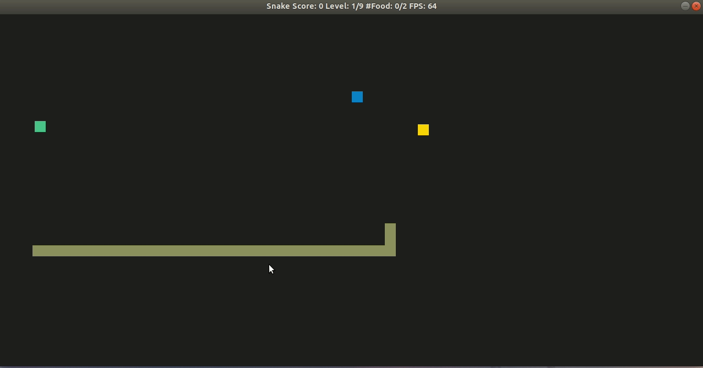
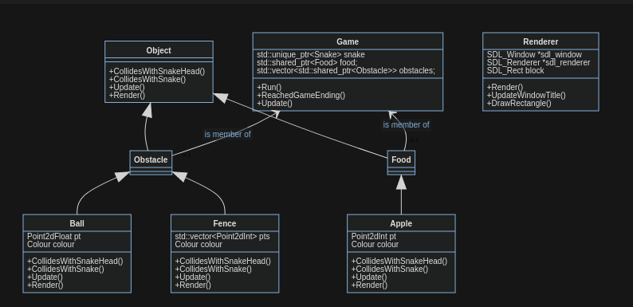

# CPPND: Capstone Snake Game

This is the Capstone project in the [Udacity C++ Nanodegree Program](https://www.udacity.com/course/c-plus-plus-nanodegree--nd213). The code for this repo was inspired by [this](https://codereview.stackexchange.com/questions/212296/snake-game-in-c-with-sdl) excellent StackOverflow post and set of responses.

### Game Overview
This project is a modification of the Snake game.
The game consists of multiple levels `maxLevels`. Advancing from one level to another requires `foodPerLevel` food to be eaten. The speed of the snake increases with each level. Once the snake collides with itself or an obstacle, the game ends. The game can be paused at any time by pressing the spacebar. The game can be canceled by pressing the escape button.

### Obstacles
There exist two types of obstacles: `Ball` and `Fence`. A ball is moving at a constant speed, bouncing back at the borders of the game. The fence is a static obstacle, which consists of a line-string with `numCornersFence` corners.

### Food
`Food` is an abstract class, which can be derived from to create any new food type. Currently, there is only `Apple` implemented. It is created randomly within the playing field.

## Class Diagram
 

## Dependencies for Running Locally
* cmake >= 3.7
  * All OSes: [click here for installation instructions](https://cmake.org/install/)
* make >= 4.1 (Linux, Mac), 3.81 (Windows)
  * Linux: make is installed by default on most Linux distros
  * Mac: [install Xcode command line tools to get make](https://developer.apple.com/xcode/features/)
  * Windows: [Click here for installation instructions](http://gnuwin32.sourceforge.net/packages/make.htm)
* SDL2 >= 2.0
  * All installation instructions can be found [here](https://wiki.libsdl.org/Installation)
  >Note that for Linux, an `apt` or `apt-get` installation is preferred to building from source. 
* gcc/g++ >= 5.4
  * Linux: gcc / g++ is installed by default on most Linux distros
  * Mac: same deal as make - [install Xcode command line tools](https://developer.apple.com/xcode/features/)
  * Windows: recommend using [MinGW](http://www.mingw.org/)

## Basic Build Instructions

1. Clone this repo.
2. Make a build directory in the top level directory: `mkdir build && cd build`
3. Compile: `cmake .. && make`
4. Run it: `./SnakeGame`.

## CC Attribution-ShareAlike 4.0 International

Shield: [![CC BY-SA 4.0][cc-by-sa-shield]][cc-by-sa]

This work is licensed under a
[Creative Commons Attribution-ShareAlike 4.0 International License][cc-by-sa].

[![CC BY-SA 4.0][cc-by-sa-image]][cc-by-sa]

[cc-by-sa]: http://creativecommons.org/licenses/by-sa/4.0/
[cc-by-sa-image]: https://licensebuttons.net/l/by-sa/4.0/88x31.png
[cc-by-sa-shield]: https://img.shields.io/badge/License-CC%20BY--SA%204.0-lightgrey.svg

## Satisfaction Project Criteria for Project Submission

### Loops, Functions, I/O

> The project demonstrates an understanding of C++ functions and control structures.

The code is organized into classes and functions (e.g. `Fence::GenerateFence()` ). Control structures such for loops (e.g. in `Fence::GenerateFence()` [code](https://github.com/klemense1/CppND-Capstone-Snake-Game/blob/master/src/obstacle/fence.cpp#L37-L53)) or while loops (e.g. in Fence Constructor [code](https://github.com/klemense1/CppND-Capstone-Snake-Game/blob/master/src/obstacle/fence.cpp#L11-L22)) have been introduced where necessary.

### Object Oriented Programming

> The project uses Object Oriented Programming techniques.

> Classes use appropriate access specifiers for class members.

> Classes encapsulate behavior.

The code is organized into classes (e.g. `Apple`, `Fence`) to group data and access and modifiers to that data.  The data might be position, shape or other. Class methods (e.g. `Fence::GenerateFence()`) modify the data.

Class data members are usually made private (e.g. [code](https://github.com/klemense1/CppND-Capstone-Snake-Game/blob/master/src/obstacle/fence.h#L25)) to prevent misuse. If members need to be accessed or modified from outside of the class, getter or setter functions have been defined (e.g. [code](https://github.com/klemense1/CppND-Capstone-Snake-Game/blob/master/src/obstacle/fence.h#L19)).

> Class constructors utilize member initialization lists.

Members are initialized within the constructor using initialization lists, see e.g. [code](https://github.com/klemense1/CppND-Capstone-Snake-Game/blob/master/src/obstacle/fence.cpp#L7-L9).

> Classes abstract implementation details from their interfaces.

Member functions document their effects through function names. Member functions do not change program state in undocumented ways. `Const` has been used where possible to indicate and assert member functions that do not change the state of the object.

> Classes follow an appropriate inheritance hierarchy.

> Derived class functions override virtual base class functions.

Two inheritance hierarchies have been introduced

The abstract class `Object` (deriving interfaces are `Obstacle` and `Food`) only contains pure virtual functions, see [code](https://github.com/klemense1/CppND-Capstone-Snake-Game/blob/master/src/object.h#L21-L24). `Obstacle` and `Food` are still abstract classes and have been introduced to facilitate dynamic polymorphism (see [code](https://github.com/klemense1/CppND-Capstone-Snake-Game/blob/master/src/game.h#L21)). 

The second inheritance hierarchy are 

- deriving classes `Fence` and `Ball` from `Obstacle`, 
- deriving class `Apple` from `Food`.

Here, the pure virtual functions are overwritten, which is specified by the keyword overwrite, see e.g. [code](https://github.com/klemense1/CppND-Capstone-Snake-Game/blob/master/src/obstacle/fence.h#L15-L18).

> Templates generalize functions in the project.

The struct `Point2d` (see [code](https://github.com/klemense1/CppND-Capstone-Snake-Game/blob/master/src/geometry.h#L7-L12)) has been defined with a template describing the type of the coordinates. This allows to use the struct for both integers and floats. Also, a function [`Collides`](https://github.com/klemense1/CppND-Capstone-Snake-Game/blob/master/src/geometry.h#L22-L30) allows collision checks for two two template-based arguments of type `Point2d`.

### Memory Management

> The project makes use of references in function declarations.

Arguments are usually passed as const references, such as in [code](https://github.com/klemense1/CppND-Capstone-Snake-Game/blob/master/src/obstacle/fence.h#L17), if the argument is not modified within the function.

> The project uses destructors appropriately.

A destructor has been defined for class [`Renderer`](https://github.com/klemense1/CppND-Capstone-Snake-Game/blob/master/src/renderer.h#L21) to clean up memory for [SDL-related raw pointers](https://github.com/klemense1/CppND-Capstone-Snake-Game/blob/master/src/renderer.h#L36-L38).

> The project uses scope / Resource Acquisition Is Initialization (RAII) where appropriate.

The project uses either memory allocation on the stack or smart pointers. Thus, destructors clean up memory when leaving the scope.

> The project follows the Rule of 5.

Class `Renderer` requires the implementation of a [deconstructor](https://github.com/klemense1/CppND-Capstone-Snake-Game/blob/master/src/renderer.h#L21). To satisfy the rule of five, [move constructor](https://github.com/klemense1/CppND-Capstone-Snake-Game/blob/master/src/renderer.h#L17) and [move assignment operator](https://github.com/klemense1/CppND-Capstone-Snake-Game/blob/master/src/renderer.h#L19) have been implemented as well. Usage of the [copy constructor](https://github.com/klemense1/CppND-Capstone-Snake-Game/blob/master/src/renderer.h#L16) and [copy assignment operator](https://github.com/klemense1/CppND-Capstone-Snake-Game/blob/master/src/renderer.h#L18) has been forbidden.

> The project uses smart pointers instead of raw pointers.

The game class contains vectors of smart pointers for food and obstacles. This allows to facilitate dynamic polymorphism and call functions such as [`Update()`](https://github.com/klemense1/CppND-Capstone-Snake-Game/blob/master/src/game.cpp#L80) or [`CollidesWithSnake()`](https://github.com/klemense1/CppND-Capstone-Snake-Game/blob/master/src/game.cpp#L76) for all types of food or obstacles. Shared Pointers have been selected over unique pointers to easily pass the food and obstacle containers to the [`Renderer::Render()`](https://github.com/klemense1/CppND-Capstone-Snake-Game/blob/master/src/game.cpp#L33) member function. 

