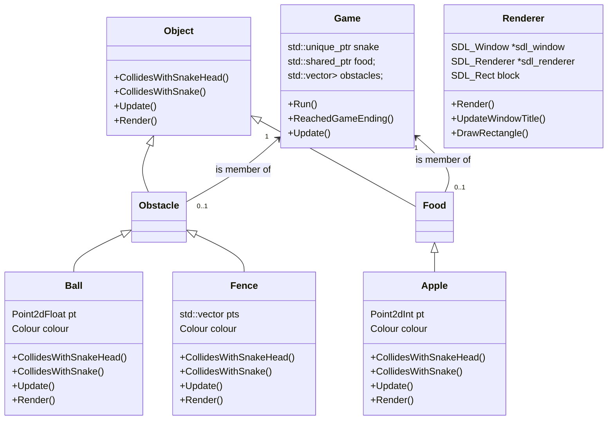

```mermaid
classDiagram
      Object <|-- Obstacle
      Object <|-- Food
      Obstacle <|-- Ball
      Obstacle <|-- Fence
      Food <|-- Apple

      Game "1" <-- "0..1" Obstacle:is member of
      Game "1" <-- "0..1" Food:is member of
      class Game {
        std::unique_ptr<Snake> snake
        std::shared_ptr<Food> food;
        std::vector<std::shared_ptr<Obstacle>> obstacles;
        +Run()
        +ReachedGameEnding()
        +Update()
      }
      class Object {
        +CollidesWithSnakeHead()
        +CollidesWithSnake()
        +Update()
        +Render()
      }
      class Obstacle{
      }
      class Ball{
        Point2dFloat pt
        Colour colour
        +CollidesWithSnakeHead()
        +CollidesWithSnake()
        +Update()
        +Render()
      }
      class Fence{
        std::vector<Point2dInt> pts
        Colour colour
        +CollidesWithSnakeHead()
        +CollidesWithSnake()
        +Update()
        +Render()
      }
      class Food{
      }
      class Apple{
        Point2dInt pt
        Colour colour
        +CollidesWithSnakeHead()
        +CollidesWithSnake()
        +Update()
        +Render()
      }
      class Renderer{
        SDL_Window *sdl_window
        SDL_Renderer *sdl_renderer
        SDL_Rect block
        +Render()
        +UpdateWindowTitle()
        +DrawRectangle()
      }
```

class-diagram